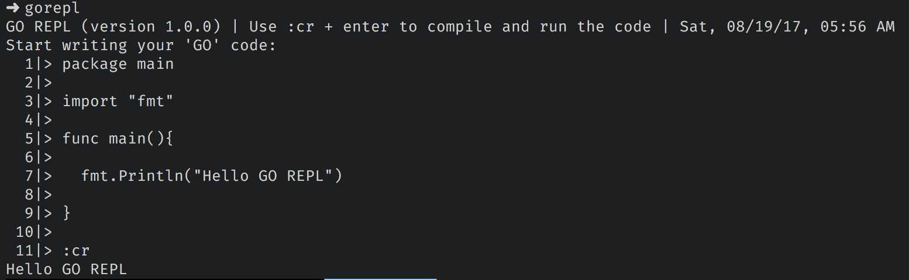

GO REPL
====================================
GO REPL is a simple application promising to write/compile/run code in terminal, inspired by python shell



### [Dwnload Binary](https://github.com/thedevsaddam/go_repl_binaries)

### Installation
On MacOS/Linux download the binary file and copy the file to `/user/local/bin/` and set permission to executable
```bash
$ cp gorepl /usr/local/bin/gorepl
$ sudo chmod +x /usr/local/bin/gorepl
```
On Windows set the `gorepl` path in your environment and run in terminal

If you are interested to build the code for your computer then
```bash
$ git clone https://github.com/thedevsaddam/go-repl.git #clone into your $GOPATH/src/
$ ./build
```

### Usage
After writing your code use a blank line then
write `:cr` and hit `enter` to ***compile*** and ***run*** code

Please see the example


### Contribution
If you love the application please feel free to send pull requests or rise issue

### **License**
The **GO REPL** is an open-source software licensed under the [MIT License](LICENSE.md).
